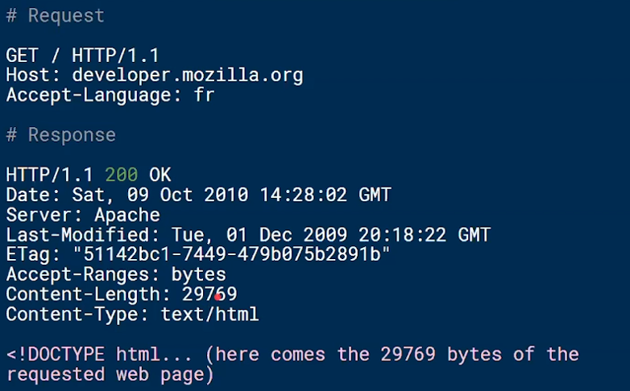
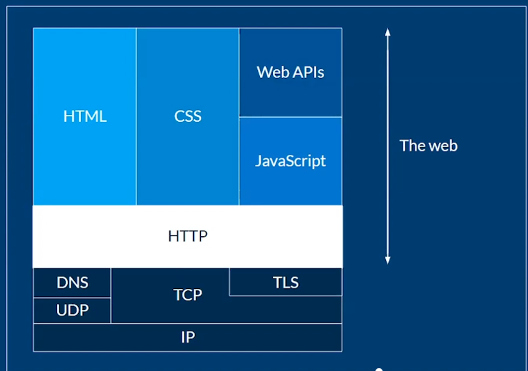
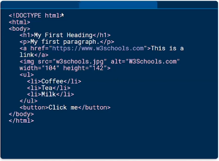
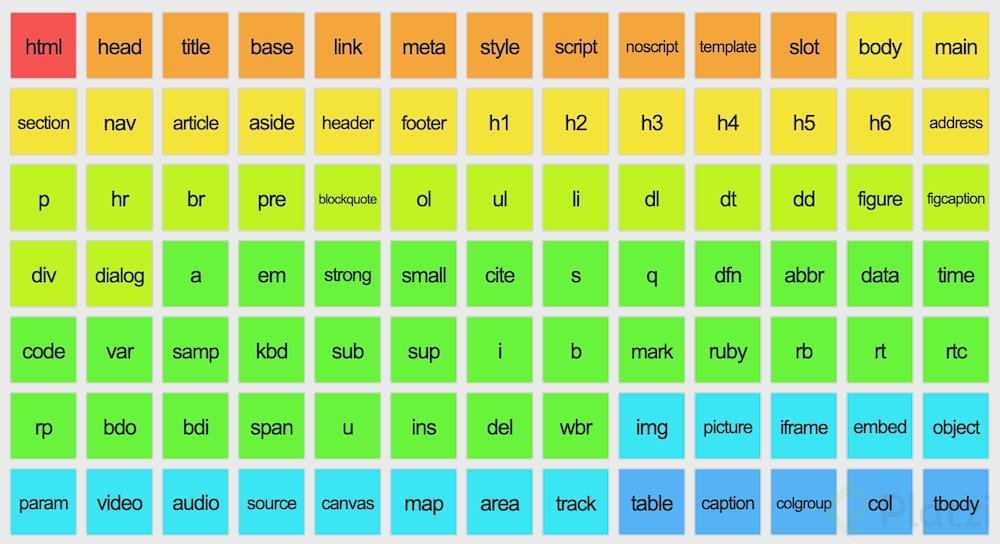
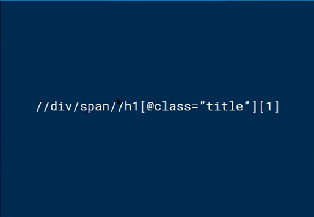
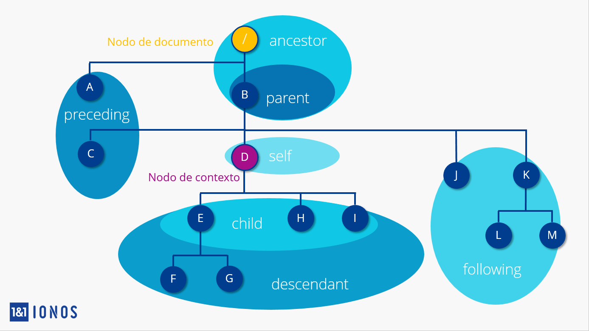
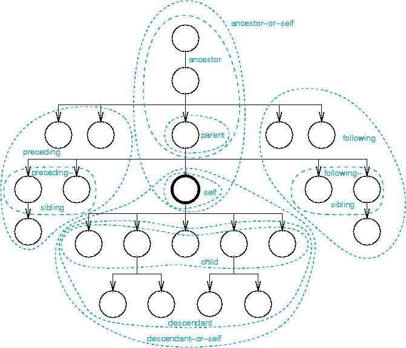
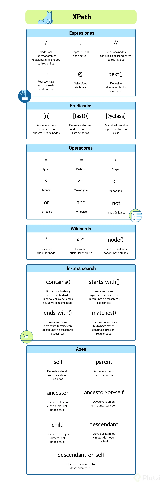

# Curso de Fundamentos de Web Scraping con Python y Xpath (Visualizar con Control + Shift + v)

- [Curso de Fundamentos de Web Scraping con Python y Xpath](#curso-de-fundamentos-de-web-scraping-con-python-y-xpath)
  - [Modulo 1 Introducción al web scraping](#modulo-1-introducción-al-web-scraping)
    - [Clase 1 Que es el web scraping](#clase-1-que-es-el-web-scraping)
    - [Clase 2 Por que aprender web scraping hoy](#clase-2-por-que-aprender-web-scraping-hoy)
    - [Clase 3 Python: el lenguaje más poderoso para extraer datos](#clase-3-python-el-lenguaje-más-poderoso-para-extraer-datos)
  - [Modulo 2 Fundamentos de la web](#modulo-2-fundamentos-de-la-web)
    - [Clase 4 Entender HTTP](#clase-4-entender-http)
    - [Clase 5  Que es HTML](#clase-5-que-es-html)
    - [Clase 6 Robots.txt: permisos y consideraciones al hacer web scraping](#clase-6-robotstxt-permisos-y-consideraciones-al-hacer-web-scraping)
  - [Modulo 3 XML Path Language](#modulo-3-xml-path-language)
    - [Clase 7 XML Path Language](#clase-7-xml-path-language)
    - [Clase 8 Tipos de nodos en XPath](#clase-8-tipos-de-nodos-en-xpath)
    - [Clase 9 Expresiones en XPath](#clase-9-expresiones-en-xpath)
    - [Clase 10 Predicados en Xpath](#clase-10-predicados-en-xpath)
    - [CLase 11 Operadores en Xpath](#clase-11-operadores-en-xpath)
    - [Clase  12 Wildcards en Xpath](#clase-12-wildcards-en-xpath)
      - [wildcard node()](#wildcard-node)
    - [Clase 13 In-text search en Xpath](#clase-13-in-text-search-en-xpath)
    - [Clase 14 Xpath Axes](#clase-14-xpath-axes)
    - [Clase 15 Resumen de XPath](#clase-15-resumen-de-xpath)
    - [Clase 16 Aplicando lo aprendido](#clase-16-aplicando-lo-aprendido)
  - [Modulo 4 Proyecto: scraper de noticias](#modulo-4-proyecto-scraper-de-noticias)
    - [Clase 17 Un proyecto para tu portafolio: scraper de noticias](#clase-17-un-proyecto-para-tu-portafolio-scraper-de-noticias)
    - [Clase 18 Construcción de las expresiones de XPath](#clase-18-construcción-de-las-expresiones-de-xpath)
    - [Clase 19  Obteniendo los articulos con python](#clase-19-obteniendo-los-articulos-con-python)
    - [Clase 20  Guardando las noticias en archivos de texto](#clase-20-guardando-las-noticias-en-archivos-de-texto)
  - [Modulo 5 Conclusiones](#modulo-5-conclusiones)
    - [Clase 21 Como continuar tu ruta de aprendizaje](#clase-21-como-continuar-tu-ruta-de-aprendizaje)


## **Modulo 1 Introducción al web scraping**

### **Clase 1 Que es el web scraping**

Es una técnica usada por data scientist y backend developers para extraer información de internet, accede a esto usando el protocolo de tranferencias de hipertexto (HTTP) o a través de un navegador. Los datos extraídos usualmente son guardados en una
base de datos, incluso en una hoja de cálculo para posteriores análisis. Puede hacerse de manera automática (bot) o manualmente.

### **Clase 2 Por que aprender web scraping hoy**

* Analizar contenido, obtener datos, comprar precios, usado por backends y data scientists.
* Las agencias de seguridad, aplicaciones que comparan precios más baratos entre hoteles, aplicaciones de Ecommerce que comparan
precios entre diferentes competidores usan web scraping. 
* Las agencias de marketing para analizar el contenido de tweets que se vuelven virales. 

En general el web scraping es una habilidad muy valiosa para cuando no tienes acceso a una API.

### **Clase 3 Python: el lenguaje más poderoso para extraer datos**

Python tiene muchos modulos para el web scrapping, tenemos requests, y Beautiful Soup, selenium, y Scrapy usado por el UK para recolectar diario datos de la poblacion.
* Request: Es una librería nos permite controlar HTTP (El conjunto de reglas o protocolos de comunicación)
* Beautiful Soup: Es una libería de pyhton qué nos sirve para extraer información HTML y XML.
* Selenium: Podemos crear navegadores fantasmas para controlar sitios web de manera automática (Bots).
* Scrapy: Permite escribir reglas para extraer los datos, es extensible por diseño, es rápido y simple.

## **Modulo 2 Fundamentos de la web**

### **Clase 4 Entender HTTP**

Conjunto de reglas por el cual dos computadores se comunican (Un cliente y un servidor). El cliente realiza peticiones a servidores.

Una petición se ve así:



**Algunos conceptos:**



* IP: Internet Protocol
* TCP: Transmision Control Protocol
* UDP: User Data Protocol
* DNS: Domain Name Server

**Tipos de respuestas Http:**

1. Respuestas informativas (100–199).
2. Respuestas satisfactorias (200–299).
3. Redirecciones (300–399).
4. Errores de los clientes (400–499).
5. Errores de los servidores (500–599).


**Http headers**

<https://developer.mozilla.org/en-US/docs/Web/HTTP/Headers>

### **Clase 5  Que es HTML**

Hypertext Markup Language. Es una lenguaje que permite definir la estructura de una página web.



**Etiquetas HTML**



<https://brandominus.com/blog/creatividad/todas-etiquetas-html5/>

### **Clase 6 Robots.txt: permisos y consideraciones al hacer web scraping**

Existen como una forma de administrar una página web. Proporciona información a los rastreadores de los buscadores sobre las páginas o los archivos que pueden solicitar o no de tu sitio web. 

Principalmente, se utiliza para evitar que tu sitio web se sobrecargue con solicitudes.

En el contexto de webscraping, le dice al scraper que puede y no extraer. Es decir hasta donde puede llegar. Ya que infrigir en la violación
de estas directivas puede acarrear un problema legal con el sitio web al que estamos scrapeando.

Robots.txt siempre se debe encontraren la raiz de un sitio.

```url
www.platzi.com/robots.txt
````

```html
User-Agent: *
Allow: /
Disallow: /*/*/concepto/*/*/material/
Disallow: /login/facebook/
Disallow: /login/twitter/
Disallow: /*/*/live/
Disallow: /*/*/%7B%7Burl%20absolute=/
Disallow: /*/*/add_contribution/
Disallow: /mi-suscripcion/
Disallow: /r/
Disallow: /clases/*/nuevos_materiales/
Disallow: /kit-ui/
Disallow: /ui/
Disallow: /sfotipy/
Disallow: /streaming/*
Disallow: /*?*
Disallow: /payments/*
Disallow: /*/add_review/
Disallow: /*/save/
Disallow: /adquirir/*
```

<https://ahrefs.com/blog/es/robots-txt/>

## **Modulo 3 XML Path Language**

### **Clase 7 XML Path Language**

XML Extensible Markup Language. Sirvio para definir interfaces, es un lenguaje de nodos o etiquetas.

Una técnica para extraer datos de allí es Xpath. Xpath es a HTML lo que las REGEX son a un texto. Es decir, Xpath es un lenguaje de patrones, expresiones que me permitirá extraer datos de un HTML. Puntualmente sirve para apuntar a partes de un documento XML.



### **Clase 8 Tipos de nodos en XPath**
 
Nodo: Es una etiqueta html con todo lo que contiene en su interior. Un nodo puede contener a otros nodos.

En otras palabras Xpath nos permitirá navegar en los diferentes niveles de profundidad deseados con el fin extraer información. Para describir los nodos y relaciones con Xpath se usan una sintaxis de ejes.

Usaremos la pagina <http://toscrape.com/>

El modelo de datos Xpath distingue siete tipos de nodos con diferentes funciones:
* Nodo de elemento (element node)
* Nodo de documento (root node) (a partir de Xpath 2.0; antes denominado “nodo raíz”)
* Nodo atributo (attribute node)
* Nodo de texto (text node)
* Nodo de espacio de nombres (namespace node)
* Nodo de instrucción de procesamiento (processing instruction node)
* Nodo de comentario (comment node)



**Fuente:** <https://www.ionos.es/digitalguide/paginas-web/desarrollo-web/tutorial-de-xpath/>

### **Clase 9 Expresiones en XPath**

```js
// slash significa el root el elemento, o un salto entre nodos.
$x('/')

// Selecciona un nodo
$x('/html')

// todos los nodos
$x('//') 

// Extraer el texto que contiene el nodo 
$x('//h1/a/text()').map(x => x.wholeText) OJO: Map se usa solo en chrome

// todos los nodos que son padre de
$x('//span/..')

// El nodo actual
$x('//span/.')

// Extraer atributos @
$x('//span/@class')
```
### **Clase 10 Predicados en Xpath**

Los predicados los hacemos con corchetes

[predicado] :Para encontrar nuestra información debemos ser más especificos.

**Predicados :**

* n : Hace referencia al n elemento de la lista.
* last(): Al último elemento de la lista.
* @atribute_name : Al usarse como predicado me trae todos los nodos que contienen este atributo
* @atribute_name="" : Al usarse como predicado me trae todos los nodos que contienen este atributo, incluso el value de este atributo.

```js
// Traer el primer elemento
$x('/html/body/div/div[1]')

// Traer el ultimo elemento
$x('/html/body/div/div[last()]')

// Traer todos los elementos con un atributo
$x('//span[@class="text"]/text()').map(x => x.wholeText)
```

### **CLase 11 Operadores en Xpath**

Hay una forma de filtrar más avanzada y es con operadores lógicos.

Operadores lógicos en Xpath :
Cabe notar que los operadores se están usando dentro del predicado.

* !=
* <>
* and
* or
* not

```js
// Filtrando con operadores
$x('//span[@class!="text"]')

// Traer los divs con posicion mayor a 5
$x('//html/body/div/div[position()>5]')

// Usando and 
$x('//span/[@class="text" and @class="tag-item"]')

// Usando or
$x('//span/[@class="text" or @class="tag-item"]')

// Usando not
$x('//span/[not(@class)']
```
### **Clase  12 Wildcards en Xpath**

Son comodines que usamos cuando no tenemos claro lo que queremos extraer.

* /* : Con asterisco le estoy diciendo que me traiga todos los nodos inmediatamente después de la expresión.
* //* : En este caso le estoy diciendo que estoy saltando en todos los niveles en todas las direcciones.
* @*: Traer todos los atributos de todos los nodos
* /node() : Nos trae además de nodos el contenido, difiere de asterisco.

```js
// Trae todo el documento porque representa la raíz de nuestro el html
$x('/*')
[html]

// * después de / pide que traiga todos los nodos que están debajo de / (* es el primer wildcard)
$x('/html/*')
(2) [head, body]

// Trae todos los nodos que están inmediatamente después de html
$x('//*')
```

```js
// Trae todos los span, que tengan como clase “text”, con @* trae todos los atributos. Dicho de otra forma, trae todos los atributos de todos los nodos de tipo span de clase “text”.
$x('//span[@class="text"]/@*')

// Todos los atributos (usando @*) de todos los div (usando //div) que están después de body.
$x('/html/body//div/@*')
```

#### **Wildcard node()**

**Node()** es similar a '*', pero este nos trae no solo los nodos sino lo que esta al final del nodo.

```js
// Trae todos los spam que sean de clase “text” que tengan un atributo @itemprop “text” y de ahí (usando node()) traer todo lo que esté dentro de los spam que cumplen las condiciones node() a diferencia de * trae no solamente los nodos, sino también todo el contenido.
$x('//span[@class="text" and @itemprop="text"]/node()')
(10) [text, text, text, text, text, text, text, text, text, text]
0: text
assignedSlot: null
baseURI: "http://quotes.toscrape.com/"
childNodes: NodeList []
data: "“The world as we have created it is a process of our thinking. It cannot be changed without changing our thinking.”"
firstChild: null
isConnected: true
lastChild: null
length: 115
nextElementSibling: null
nextSibling: null
nodeName: "#text"
nodeType: 3
nodeValue: "“The world as we have created it is a process of our thinking. It cannot be changed without changing our thinking.”"
ownerDocument: document
parentElement: span.text
parentNode: span.text
previousElementSibling: null
previousSibling: null
textContent: "“The world as we have created it is a process of our thinking. It cannot be changed without changing our thinking.”"
wholeText: "“The world as we have created it is a process of our thinking. It cannot be changed without changing our thinking.”"
__proto__: Text
1: text
2: text
3: text
4: text
5: text
6: text
7: text
8: text
9: text
length: 10
__proto__: Array(0)
```

### **Clase 13 In-text search en Xpath**

Para buscar cadenas de caracteres especificas dentro de un texto.
* start-with(.“Texto a buscar”): Empezar con, el punto hace referencia al nodo actual.
* contains (., “Texto a buscar”) : Sirve para llamar por el texto contenido en.

**Nota:** Debido a las versiones del lenguaje Xpath en los navegadores las funciones end-with y matches no están disponibles, pero una vez en código python corren sin problemas.
* end-with(.,""): Termina en.
* matches(.,""): Sirve para hacer una búsqueda en el texto de un nodo que coincida con una expresión regular.

**Reto:** Traer todos los autores que en su nombre empiezan con la letra "a", y terminan con la letra "l"

Inicia con letra "A"

```js
$x('//small[@class="author" and starts-with(., "A")]/text()').map(x =>x.wholeText)
// Devuelve 4 ["Albert Einstein", "Albert Einstein", "Albert Einstein", "André Gide"]
```

El nombre contiene "Ro"

```js
$x('//small[@class="author" and contains(., "Ro")]/text()').map(x =>x.wholeText)
// (2) ["J.K. Rowling", "Eleanor Roosevelt"]
```

Termina con letra "t"

```js
$x('//small[@class="author" and ends-with(., "l")]/text()').map(x =>x.wholeText)
/* VM3928:1 Uncaught DOMException: Failed to execute '$x' on 'CommandLineAPI': The string '//small[@class="author" and ends-with(., "l")]/text()' is not a valid XPath expression.
    at <anonymous>:1:1
(anonymous) @ VM3928:1*/
// No funciona porque el navegador esta basado en la version 1 de xpath
```

Ejemplo con matches

```js
$x('//small[@class="author" and matches(., "A.*n")]/text()').map(x =>x.wholeText)
```

### **Clase 14 Xpath Axes**

Un eje representa una relación entre el nodo actual. Es usado para localizar nodos relativos a el nodo en el DOM tree.



**Recursos adicionales:**
* <https://www.w3schools.com/xml/xpath_axes.asp>

* <https://devhints.io/xpath>

El termino 'div/.' equivale a self::div es azúcar sintáctica

```js
$x('/html/body/div/self::div')

$x('/html/body/div/child::div')
// [div.row.header-box, div.row]

$x('/html/body/div/descendant::div')

$x('/html/body/div/descendant-or-self::div')
/* [div.container, div.row.header-box, div.col-md-8, div.col-md-4, div.row, div.col-md-8, div.quote, div.tags, div.quote, div.tags, div.quote, div.tags, div.quote, div.tags, div.quote, div.tags, div.quote, div.tags, div.quote, div.tags, div.quote, div.tags, div.quote, div.tags, div.quote, div.tags, div.col-md-4.tags-box]*/
```

### **Clase 15 Resumen de XPath**



### **Clase 16 Aplicando lo aprendido**

Desde <http://books.toscrape.com/>

Extraer todos los nombres de los libros

```js
$x('//article[@class="product_pod"]/h3/a/@title').map(x => x.value)

(20) ["A Light in the Attic", "Tipping the Velvet", "Soumission", "Sharp Objects", "Sapiens: A Brief History of Humankind", "The Requiem Red", "The Dirty Little Secrets of Getting Your Dream Job", "The Coming Woman: A Novel Based on the Life of the Infamous Feminist, Victoria Woodhull", "The Boys in the Boat: Nine Americans and Their Epic Quest for Gold at the 1936 Berlin Olympics", "The Black Maria", "Starving Hearts (Triangular Trade Trilogy, #1)", "Shakespeare's Sonnets", "Set Me Free", "Scott Pilgrim's Precious Little Life (Scott Pilgrim #1)", "Rip it Up and Start Again", "Our Band Could Be Your Life: Scenes from the American Indie Underground, 1981-1991", "Olio", "Mesaerion: The Best Science Fiction Stories 1800-1849", "Libertarianism for Beginners", "It's Only the Himalayas"]
```

Extraer todos los precios de todos los libros

```js
$x('//article[@class="product_pod"]/div[@class="product_price"]/p[@class="price_color"]/text()').map(x => x.wholeText)
(20) ["£51.77", "£53.74", "£50.10", "£47.82", "£54.23", "£22.65", "£33.34", "£17.93", "£22.60", "£52.15", "£13.99", "£20.66", "£17.46", "£52.29", "£35.02", "£57.25", "£23.88", "£37.59", "£51.33", "£45.17"]
```

Extraer las categorías

```js
// Trim para eliminar los espacios vacios en la salida
$x('//div[@class="side_categories"]/ul[@class="nav nav-list"]/li/ul/li/a/text()').map(x => x.wholeText.trim())
```

Extraer las descripciones

```js
$x('//article[@class="product_page"]/p/text()').map(x => x.wholeText)
```

Extraer el stock

```js
$x('//article[@class="product_page"]/table[@class="table table-striped"]/tbody/tr/td[starts-with(., "In stock")]/text()').map(x => x.wholeText)
$x('//p[@class="instock availability"]/text()[2]').map(x=>x.wholeText.trim())
```

## **Modulo 4 Proyecto: scraper de noticias**

### **Clase 17 Un proyecto para tu portafolio: scraper de noticias**

Este proyecto es un scraper de noticias del diario La Republica. Vamos a extraer del periodico: encabezados y cuerpo de las noticias diariamente y almancenarlos para un posterior análisis. La pagina target <https://www.larepublica.co/>

* **Notas:** Observar https://www.larepublica.co/robots.txt para tener claro a qué podemos o no acceder con nuestro scraper
* **Entorno de trabajo:** Es necesario tener buenas prácticas para desarrollar

A continuación la configuración de este proyecto.

Es posible realizar estas acciones desde cualquier otro shell. En este curso se usa Cmder o **CMD**. Cmder es un emulador de bash, a partir de los comandos nativos de windows generamos una “aliases” que tratan de igualar los comandos que tenemos en consola de tipo UNIX.

1. Ir a la carpeta donde se alojará el proyecto

    ```
    cd "Ruta del proyecto"
    cd "C:\Users\param\OneDrive\Documentos\Cursos\Python\Modern Web Scraping with Python\Curso de Platzi\Proyecto_La_Republica_Scraping"
    ```

2. Inicializar git en el directorio de trabajo

    ```
    git init
    ```
3. Crear el ambiente virtual

    ```
    py -m venv venv
    ```

4. Crear en el directorio de trabajo o carpeta un archivo .gitignore y escribir que ignore la carpeta del ambiente virtual. No se desea ocupar espacio innecesario y no es buena práctica.

    ```
    *Dentro del .gitignore escribir:*
    venv/ (nombre de la carpeta que vamos a ignorar)/
    ```

4. Activar el ambiente virtual

    ```
    venv\Scripts\activate
    ```

5. Si se trabaja en VsCode, se crea un Workspace para tener una estructura más organizada. Para ello se guarda como workspace (save as workspace), permitiendo que VS tenga idea de qué se tiene en la capeta.

6.  Instalar dependencias de este proyecto:
    * Request: Para realizar peticiones
    * Lxml: Para utilizar Xpath
    * Autopep8: Ayuda a formatear el código según los estilos oficiales del lenguaje

    ```
    pip install requests lxml autopep8
    ```

7. Actualizar el manejador de paquetes de Python. Es buena práctica tenerlo actualizado (Si es que está desactualizado)

    ```
    py -m pip install pip --upgrade
    ```

### **Clase 18 Construcción de las expresiones de XPath**

```py
# $x('//div/a[starts-with(@class,"kicker")]/@href[contains(.,"www.larepublica.co")]').map(x => x.value)
links = '//div/a[starts-with(@class,"kicker")]/@href[contains(.,"www.larepublica.co")]'

# $x('//div[@class="mb-auto"]/h2/span/text()').map(x => x.wholeText)
Titulo = '//div[@class="mb-auto"]/h2/span/text()'

# $x('//div[@class="lead"]/p/text()').map(x => x.wholeText)
Resumen = '//div[@class="lead"]/p/text()'

# $x('//div[@class="html-content"]/p[not(@class)]/text()').map(x => x.wholeText)
Cuerpo =  '//div[@class="html-content"]/p[not(@class)]/text()'

# $x('//div[@class = "autorArticle"]/p/text()').map(x => x.wholeText)
Autor = '//div[@class = "autorArticle"]/p/text()'
```

### **Clase 19  Obteniendo los articulos con python**
```
scraper.py
```
```py
import requests
import lxml.html as html
import os
import datetime

HOME_URL = 'https://www.larepublica.co/'

XPATH_LINK_TO_ARTICLE = '//h2[@class="headline"]/a/@href'
XPATH_TITLE =  '//h1[@class="headline"]/a/text()'
XPATH_SUMMARY = '//div[@class="lead"]/p/text()'
XPATH_BODY = '//div[@class="articleWrapper  "]/p[not(@class)]/text()'


def parse_notice(link, today):
    try:
        response = requests.get(link)
        if response.status_code == 200:
            notice = response.content.decode('utf-8')
            parsed = html.fromstring(notice)
            try:
                title = parsed.xpath(XPATH_TITLE)[0]
                title = title.replace('\"', '')
                title = title.replace('/', '-')
                summary = parsed.xpath(XPATH_SUMMARY)[0]
                body = parsed.xpath(XPATH_BODY)
            except IndexError:
                return
        else:
            raise ValueError(f'Error: {response.status_code}')
    except ValueError as  ve:
        print(ve)

def parse_home():
    try:
        response = requests.get(HOME_URL)
        if response.status_code == 200:
            home = response.content.decode('utf-8')
            parsed = html.fromstring(home)
            links_to_notices = parsed.xpath(XPATH_LINK_TO_ARTICLE)
            # print(links_to_notices)
            today = datetime.date.today().strftime('%d-%m-%Y')
            if not os.path.isdir(today):
                os.mkdir(today)

            for link in links_to_notices:
                parse_notice(link, today)

        else:
            raise ValueError(f'Error: {response.status_code}')

    except ValueError as ve:
        print(ve)


def run():
    parse_home()


if __name__ == '__main__':
    run()
```

### **Clase 20  Guardando las noticias en archivos de texto**

```py
import requests
import lxml.html as html
import os
import datetime

# Constantes

HOME_URL = 'https://www.larepublica.co/'
XPATH_LINK_TO_ARTICLE = '//div/a[starts-with(@class,"kicker")]/@href[contains(.,"www.larepublica.co")]'
XPATH_LINK_TO_TITLE = '//div[@class="mb-auto"]/text-fill/span/text()'
XPATH_LINK_TO_SUMMARY = '//div[@class="lead"]/p/text()'
XPATH_LINK_TO_BODY = '//div[@class="html-content"]/p[not(@class)]/text()'
XPATH_LINK_TO_AUTHOR = '//div[@class = "autorArticle"]/p/text()'

# Funciones para ejecutar el script

def parse_notice(link, today):

    #Bloque para manejar los status code u otros errores que se presenten
    try:
        
        #Respuesta de una petición al conectarse a un url
        response = requests.get(link)

        # Comprobar que la respuesta sea OK, comprobando el status code
        if response.status_code == 200:

            # Trae el contenido de HTML (content) que necesita ser traducido (decode) de tal manera que python lo entienda
            notice = response.content.decode('utf-8')

            # Transforma el contenido HTML a un archivo útil para Xpath
            parsed = html.fromstring(notice)
            
            # Bloque para validar que estoy traendo el título, autor, resumen y cuerpo de la noticia.
            try:

                # Traer el primer elemento de la lista. (El título tiene un solo elemento)
                title = parsed.xpath(XPATH_LINK_TO_TITLE)[0]
                # Quitar las comillas dobles del título, evitando un error en OS.
                title = title.replace('\"', '')
                # Traer el primer elemento del autor. (El autor tiene un solo elemento)
                author = parsed.xpath(XPATH_LINK_TO_AUTHOR)[0]

                # Traer el primer elemento del resumen. (El resumen tiene un solo elemento)
                summary = parsed.xpath(XPATH_LINK_TO_SUMMARY)[0]
                
                # Traer el contenido del cuerpo
                body = parsed.xpath(XPATH_LINK_TO_BODY)

            except IndexError:
                # Se prevee cuando una noticia no tenga un resumen u otro elemento
                return
            
            # Guardar el contenido de la noticia en un archivo dentro de la carpeta previamente creada.
            # with es un manejador de contexto que nos permite mantener las cosas de forma segura si algo sucede y el script se cierra
            with open(f'{today}/{title}.txt','w', encoding ='utf-8') as f:

                # Escribir en el archivo el título de la noticia
                f.write(title)
                f.write('\n\n')

                # Escribir en el archivo el autor de la noticia
                f.write(author)
                f.write('\n\n')

                # Escribir en el archivo el resumen de la noticia
                f.write(summary)
                f.write('\n\n')

                # Escribir en el archivo el cuerpo de la noticia
                for p in body:
                    f.write(p)
                    f.write('\n')
                print("FIN 1")
        else:
            raise ValueError(f'Error: {response.status_code}')
    except ValueError as ve:
        print(ve)

def parse_home():

    #Bloque para manejar los status code u otros errores que se presenten
    try:
        
        #Respuesta de una petición al conectarse a un url
        response = requests.get(HOME_URL)
        
        # Comprobar que la respuesta sea OK, comprobando el status code
        if response.status_code == 200:
            
            # Trae el contenido de HTML (content) que necesita ser traducido (decode) de tal manera que python lo entienda
            home = response.content.decode('utf-8')
            
            # Transforma el contenido HTML a un archivo útil para Xpath
            parsed = html.fromstring(home)
            
            # Extrae las urls de la página web usando Xpath, usando el archivo parseado previamente
            links_to_notices = parsed.xpath(XPATH_LINK_TO_ARTICLE)
            
            # print(links_to_notices)

            # Extrae la fecha actual. Se usa strftime para tener una cadena de caracteres con un determinado formato
            today = datetime.date.today().strftime('%d-%m-%Y')

            # Verifica que no exista una carpeta con el nombre de la fecha de hoy, para posteriormente crearlo.
            if not os.path.isdir(today):
                os.mkdir(today)

            # Llamo a la función para recorrer la lista de los links usando un for.
            for link in links_to_notices:
                parse_notice(link, today)

        else:
            # Elevar un error (ValueError), mostrando el status code
            raise ValueError(f"Error: {response.status_code}")
    except ValueError as ve:
        print(ve)

# Función para ejecutar los scripts
def run():
    parse_home()

# Menu principal
if __name__ == '__main__':
    run()
```

## **Modulo 5 Conclusiones**

### **Clase 21 Como continuar tu ruta de aprendizaje**

Consejos

* Revisa siempre robots.txt
* Ten en cuenta si violas alguna ley de proteccion de datos
* Si el medio es de pago, evita hacer web scrapping por default no es legal

<https://www.upwork.com/>

<https://www.workana.com/es>